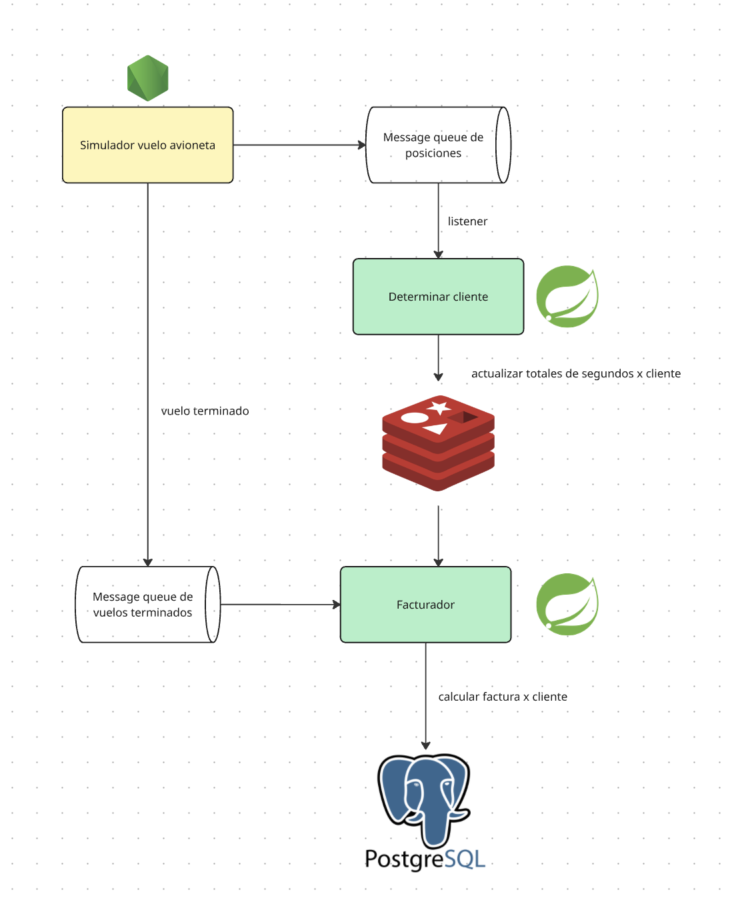

    
# Fumigación - Ejemplo con Message Queue

Trabajamos en el área de sistemas de una empresa que se dedica a la fumigación ecológica de parcelas, para lo cual tenemos aviones que salen a hacer vuelos de fumigación. Nuestro input es que desde que despega hasta que aterriza el avión nos va enviando su geolocalización. Luego nosotros le cobramos un monto calculando en base al tiempo que estuvo sobrevolando el avión por cada una de las parcelas de nuestros clientes.

Necesitamos entonces

- servicios con una alta capacidad, que necesitan no solo durabilidad sino la posibilidad de ser tolerante a fallas (si nuestro servidor del backend esté caído debe procesarlo en otro momento pero de ninguna manera podemos perder el registro sobre los vuelos de los aviones para facturar)
- servicios que necesitan ser igualmente durables, pero que tienen una baja frecuencia de uso, como la que toma los acumulados para finalmente emitir la factura a cada cliente



## Iniciando la queue

```bash
docker compose up -d
```

## Ingestor de datos

Es el proceso que simula el despegue de un avión por lo que va a estar emitiendo coordenadas que simulan el vuelo sobre diferentes parcelas.

- [podés ver cómo invocarlo en esta página](./docs/simulador-vuelo.md)
- [y una vez finalizado el proceso podés ver la información generada en la cola siguiendo estos pasos](./docs/como-ver-info-queue.md)

## Geoprocesador de Parcelas

El proceso donde convertimos las posiciones x/y en información de facturación de nuestros clientes

- [leyendo la queue con un mecanismo de reintentos](./docs/procesamiento-queue-con-retry.md)
- [y actualizando un buffer intermedio en Redis](./docs/buffer-en-redis.md)

## Facturación

Cuando el vuelo se termina,

- [el proceso de Node nos avisa dejando un mensaje en otra cola](./docs/final-vuelo.md)
- [y otro listener será entonces el encargado de procesar los resultados y generar una factura](./docs/facturacion.md)

De esa manera seguimos el modelo _event-driven_.