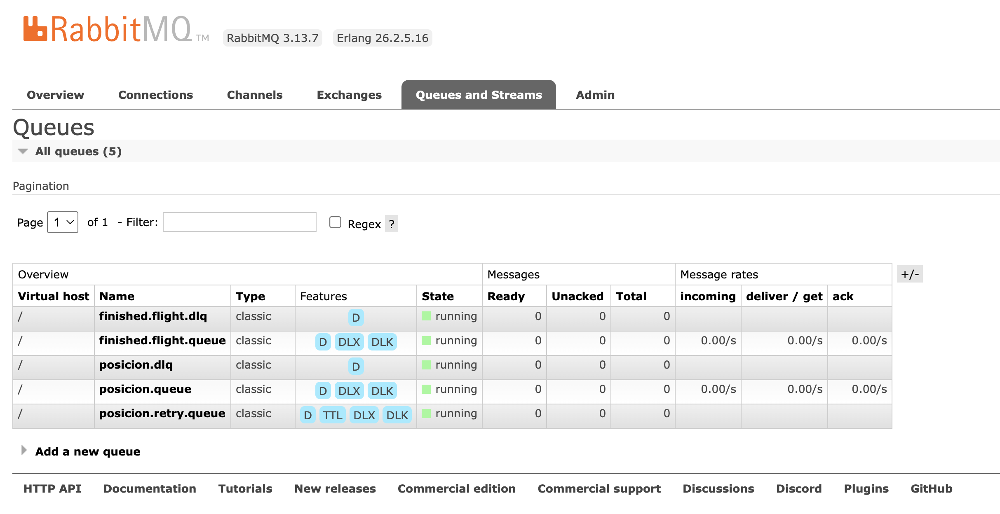
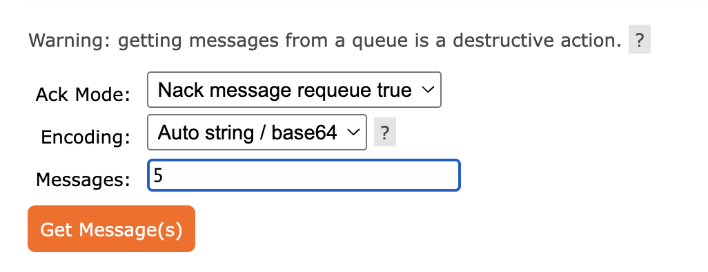
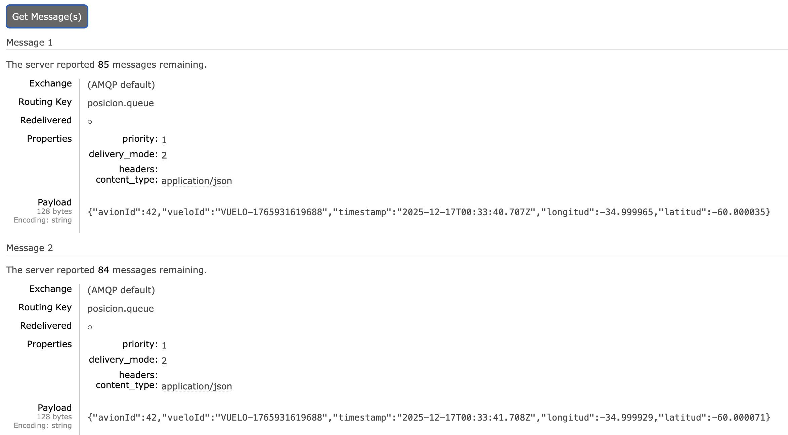

## Cómo ver los mensajes de la queue

### Paso 1: Acceder a la Interfaz de Administración

Como usamos la imagen `rabbitmq:3-management` en el `docker-compose.yml`, la interfaz ya está corriendo.

Abrí tu navegador web en la siguiente URL: http://localhost:15672

Ingresa las credenciales por defecto:

- Username: guest
- Password: guest

### Paso 2: Localizar la Cola de Posiciones

Una vez dentro del dashboard de RabbitMQ:

- Clickeá en la pestaña "Queues" (Colas).
- Buscá tu cola de posiciones: `posicion.queue`

Si el simulador de Node.js está corriendo y tu aplicación Kotlin (el consumidor) no está corriendo, verás que el contador de mensajes en la columna "Ready" (Listos) estará aumentando rápidamente. Esto significa que los mensajes están esperando a ser procesados.

Si ambos (productor y consumidor) están corriendo, el contador de mensajes debería mantenerse cerca de cero, ya que Spring Boot consume los mensajes tan rápido como Node.js los produce.

### Paso 3: Inspeccionar los Mensajes (Get Messages)

Para ver el contenido JSON exacto que está enviando tu simulador, hacé click en el nombre de la cola: `posicion.queue`. Podés ejecutar el simulador y detener la aplicación de Springboot para ver más cómodamente los mensajes.

En la página de detalles de la cola, buscá el panel llamado "Get messages" (Obtener mensajes). En el campo "Messages", poné un número pequeño (ej. 1 o 5) para extraer esa cantidad de mensajes.

> **IMPORTANTE**: Asegurate de que la opción "Requeue" (Volver a encolar) esté seleccionada a "Yes" (Sí). Esto es crucial: si pedís mensajes de la cola y no los volvés a encolar, el consumidor de Kotlin no los verá.

Hacé click en el botón "Get Messages".

Verás el mensaje con el payload JSON exacto, incluyendo los campos `vueloId`, `latitud`, `longitud`, y `timestamp`. Esto es perfecto para verificar que el formato de Node.js coincide con lo que espera tu GeoprocesadorService de Kotlin.
