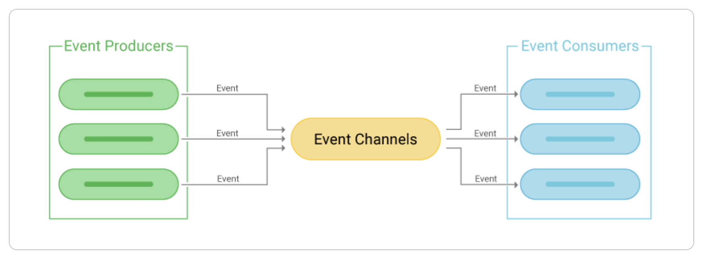

## Vuelo terminado

Al final de la simulación agregamos un mensaje en la queue de vuelos terminados:

- es el proceso node el que inicia y termina el vuelo
- el mecanismo de guardado en la queue no sufre demoras, por eso se dispara de manera sincrónica
- del lado de Springboot tendremos un listener escuchando la queue
- de esa manera, la comunicación entre las apps de Node y Springboot se hace de manera desacoplada a partir de eventos

