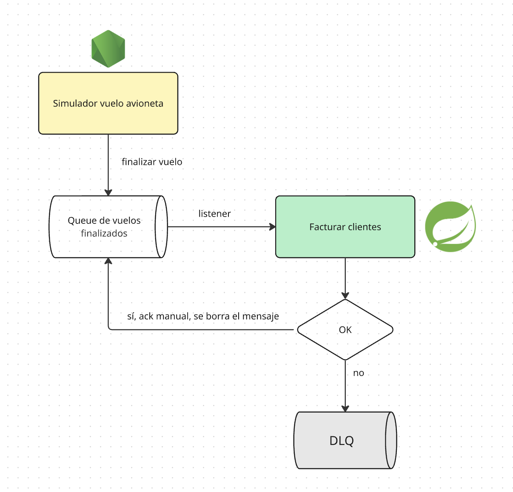

## Vuelo terminado

Para facturar necesitamos una condición de corte: lo mejor parece ser esperar a que el vuelo termine.

Agregamos entonces 

- una nueva queue en Springboot
- y un nuevo listener

## Configuración de la queue

Vamos a trabajar con

- una cola aparte para los vuelos terminados
- en caso de error, enviaremos el mensaje directamente a la DLQ (_Dead Letter Queue_)
- hay una cola de _exchange_ que sirve para enrutar los mensajes a la DLQ

Podés ver la configuración en [RabbitMQConfig](../src/main/kotlin/ar/edu/unsam/fumigacion/config/RabbitMQConfig.kt).

## Listener

El [FacturadorService](../src/main/kotlin/ar/edu/unsam/fumigacion/service/FacturadorService.kt) se implementa de esta manera:

```kotlin
    @RabbitListener(queues = [FINISHED_FLIGHT_QUEUE], ackMode = "MANUAL")
    @Transactional
    fun procesarVueloTerminado(
        vueloTerminado: VueloTerminado,
        channel: Channel,
        @Header(AmqpHeaders.DELIVERY_TAG) tag: Long
    ) {
        try {
            val facturas = fumigacionRepository.obtenerDatosDeVuelo(vueloTerminado.vueloId).map {
                fumigacionCliente -> Factura(
                    descripcion = "Servicio de fumigación - ${vueloTerminado.vueloId}",
                    total = fumigacionCliente.cantidad * 150.0,
                    cliente = clienteRepository.getReferenceById(fumigacionCliente.clienteId),
                )
            }
            facturaRepository.saveAll(facturas)
            fumigacionRepository.borrarDatosDeVuelo(vueloTerminado.vueloId)
            channel.basicAck(tag, false)
        } catch (ex: Exception) {
            channel.basicReject(tag, false)
        }
    }
```

- escuchamos la queue de vuelos terminados
- manejamos en forma manual el ack (basicAck / basicReject)
- leemos los acumulados por vuelo/cliente, es una cantidad limitada, pero lo resolvemos con un solo query:

```kotlin
    fun obtenerDatosDeVuelo(vueloId: String): List<FumigacionCliente> {
        val pattern = "fumigacion:vuelo:$vueloId:cliente:*"
        val keys = stringRedisTemplate.keys(pattern)
        ...
        val ops = stringRedisTemplate.opsForHash<String, String>()

        return keys.mapNotNull { key ->
            val data = ops.entries(key)
            ...
            val clienteId = key.substringAfterLast(":").toLong()
            FumigacionCliente(
                clienteId = clienteId,
                cantidad = data["cantidad"]?.toLong() ?: 0L,
                desde = data["desde"]?.let { Instant.parse(it) },
                hasta = data["hasta"]?.let { Instant.parse(it) }
            )
        }
    }
```

- construimos la lista de facturas: un detalle adicional es que getReferenceById() de ClienteRepository genera un **proxy** (no se dispara un SELECT a la base, sino que se toma el id de cliente de Redis sin ningún otro dato, porque es lo único que necesitamos para hacer el INSERT posterior)
- hacemos un `saveAll` para guardar en lotes las facturas
- la configuración del batch size se hace en el archivo `application.yml`

```yml
spring:
  jpa:
    properties:
      hibernate:
        jdbc:
          batch_size: 50     # grabamos de a 50 facturas
```

- borramos la información que teníamos en Redis: es simple ya que la branch `"fumigacion:vuelo:$vueloId:cliente:*"` contiene toda la información del vuelo en cuestión
- por último damos el ack de que procesamos el vuelo finalizado correctamente
- en caso de error, el basicReject se encarga de avisar a la cola de exchange de que debe mandar el mensaje a la DLQ

