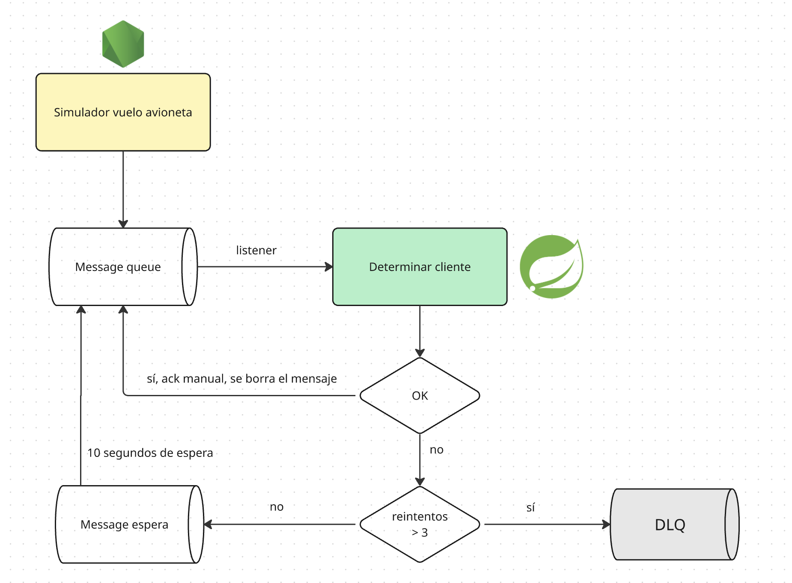

## Mecanismo básico

Podríamos implementarlo así

```kotlin
@RabbitListener(queues = [POSICION_QUEUE])
    @Transactional
    fun procesarPosicion(posicion: PosicionAvion) {
        // --- 1. Lógica de Geoposicionamiento ---
        val cliente = identificarClientePorUbicacion(posicion.longitud, posicion.latitud)
        ...
```

pero eso hace que automáticamente al recibir el mensaje lo elimine de la queue, lo que se conoce como **auto ack**.

## Agregamos mecanismos de ack, reintentos y una DLQ

Esto lo hacemos en RabbitMQConfig:

```kotlin
    // ---------------------------
    // Queues
    // ---------------------------
    @Bean
    fun posicionQueue() =
        QueueBuilder.durable(POSICION_QUEUE)
            // cuando falla → retry exchange
            .withArgument("x-dead-letter-exchange", POSICION_RETRY_EXCHANGE)
            .withArgument("x-dead-letter-routing-key", POSICION_RETRY_QUEUE)
            .build()

    @Bean
    fun posicionRetryQueue() =
        QueueBuilder.durable(POSICION_RETRY_QUEUE)
            // ⏱ delay de retry
            .withArgument("x-message-ttl", 10_000)
            // cuando vence → vuelve a la main
            .withArgument("x-dead-letter-exchange", POSICION_EXCHANGE)
            .withArgument("x-dead-letter-routing-key", POSICION_QUEUE)
            .build()

    @Bean
    fun posicionDlq() =
        QueueBuilder.durable(POSICION_DLQ).build()
```

Además veamos cómo está escrito nuestro listener:

```kotlin
    @RabbitListener(queues = [POSICION_QUEUE], ackMode = "MANUAL")
    @Transactional
    fun procesarPosicion(
        posicion: PosicionAvion,
        channel: Channel,
        @Header(AmqpHeaders.DELIVERY_TAG) tag: Long,
        @Header(name = "x-death", required = false) xDeath: List<Map<String, Any>>?
    ) {
        try {
            val cliente = identificarClientePorUbicacion(
                posicion.longitud,
                posicion.latitud
            )
            if (cliente != null) {
                redisFumigacionRepository.incrementCounter(
                    formatearAMinuto(posicion.timestamp),
                    cliente.id
                )
            }
            channel.basicAck(tag, false)
        } catch (ex: Exception) {
            val retryCount = xDeath
                ?.firstOrNull { it["queue"] == POSICION_QUEUE }
                ?.get("count")
                ?.toString()
                ?.toLong() ?: 0

            if (retryCount >= 3) {
                channel.basicReject(tag, false)
            } else {
                channel.basicNack(tag, false, false) // retry
            }
        }
    }
```

Con ambas cosas podemos decir:

- `posicion.queue` como la cola principal de consumo, donde el listener procesa aquí las posiciones de los aviones.
- cuando el mensaje se procese correctamente, se envía el ack en forma manual (`basicAck`)
- si el mensaje es rechazado con un `basicNack` el mensaje se envía a la cola exchange de retry
- si el mensaje es rechazado con un `basicReject` y `requeue=false`
- `posicion.retry.exchange` es una **cola de espera** entre reintentos (lo configuramos en 10 segundos, es el TTL o Time to Leave)
- cuando el TTL expira, el mensaje se pasa a la `posicion.queue` nuevamente, para reintentar el envío del mensaje
- la cantidad de reintentos se especifica en forma programática, en nuestro caso es 3, eso define que no queremos seguir intentando (para no entrar en loop infinito)
- el mensaje de todas maneras **no se descarta**, queremos llevarlo aparte a una _Dead Letter Queue_ (DLQ) para poderla analizar
- es una buena práctica no perder los mensajes descartados (a veces queremos también guardar los procesados en caso de operaciones sensibles)

### Auto Ack vs. Manual Ack

La configuración de la queue nos permite evitar el auto ack, que al leer un mensaje lo elimina de la cola: si al hacer el procesamiento del punto tenemos un error, perderíamos información. Tener una queue de exchange nos permite esperar a que nosotros manualmente marquemos con un basicAck / basicNack el estado del mensaje en la queue.

Por otra parte, la queue no participa de la transacción dentro del método del service (la anotación `@Transactional` no juega ningún papel aquí). Esto implica que enviar al channel estos mensajes

- `basicAck`
- `basicNack`
- `basicReject`

tiene efecto inmediato, a diferencia de cuando usamos llamadas dentro de JPA de Springboot (donde un error no chequeado automáticamente genera un _rollback_ de la transacción).

Un detalle importante es que nuestro listener tiene que indicar que el ACK es manual:

```kotlin
@RabbitListener(queues = [POSICION_QUEUE], ackMode = "MANUAL")
```

de lo contrario te aparecerá un mensaje como el que sigue:

```text
com.rabbitmq.client.ShutdownSignalException: channel error; protocol method: #method<channel.close>(reply-code=406, reply-text=PRECONDITION_FAILED - unknown delivery tag 1, class-id=60, method-id=80)
	at com.rabbitmq.client.impl.ChannelN.asyncShutdown(ChannelN.java:528) ~[amqp-client-5.25.0.jar:5.25.0]
	at com.rabbitmq.client.impl.ChannelN.processAsync(ChannelN.java:349) ~[amqp-client-5.25.0.jar:5.25.0]
```

## Header X-Death

La manera en que el listener puede contar los reintentos es a través de `x-death`, un header automático que agrega RabbitMQ a un mensaje cuando ese mensaje es dead-lettered, es decir, cuando:

- es rechazado con basicReject(requeue = false) o basicNack(requeue = false), o
- expira por TTL (x-message-ttl), o
- se excede un límite de cola (overflow)

La información que contiene el header es la siguiente:

```text
x-death = [
  {
    queue: "posicion.queue",
    exchange: "posicion.retry.exchange",
    reason: "rejected",
    count: 3,
    time: 2025-09-15T10:34:21Z
  }
]
```

Esta información es propia de cada mensaje y cada vez que hay un rechazo RabbitMQ incrementa el count.

### Resumen del proceso

Dejamos a continuación un diagrama de flujo del proceso:

