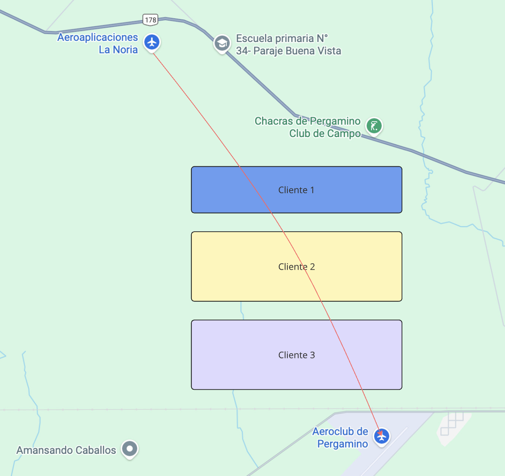

## Simulador de vuelo

Para disparar el proceso de node hay que posicionarse en la carpeta [simulator](../simulator).

Descargá la primera vez las dependencias

```bash
nvm use
pnpm install
```

Y luego ejecutá

```bash
pnpm run dev
```

En la consola vas a ver la información al azar que se produce y se envía a la cola que la almacena:

```bash
✈️ Vuelo VUELO-1765841772158 iniciado
Desde (-35, -60) → (-34.997, -60.003)
[8:36:13 PM] → (-60.000035, -34.999965)
[8:36:14 PM] → (-60.000071, -34.999929)
```

El proceso simula un vuelo que pasa por 3 clientes conocidos en nuestra base Postgres, pasando de un aeroclub a otro. Va dejando información de

- latitud
- longitud
- el id de vuelo
- el id del avión (como dato anecdótico)
- y el timestamp (el momento, por las dudas para sincronizar)

