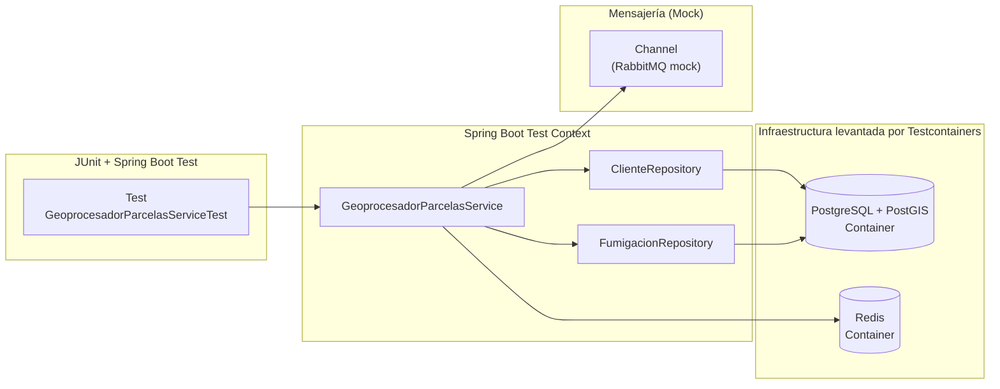

## Testeo de Integración

Al igual que en otros ejemplos, decidimos implementar tests de integración partiendo de nuestros services: eso permite que alcancemos más del 90% de cobertura.

## Test del servicio geoprocesador

Las dependencias que tenemos son

- por un lado necesitamos una instancia de la BD de clientes (Postgres)
- también necesitamos tener levantado el servicio de Redis, para guardar la información
- el servicio en sí es un listener de la queue, que estaremos mockeando para simular que nos llega data

La novedad que tiene este ejemplo es que **levanta contenedores Docker**:

