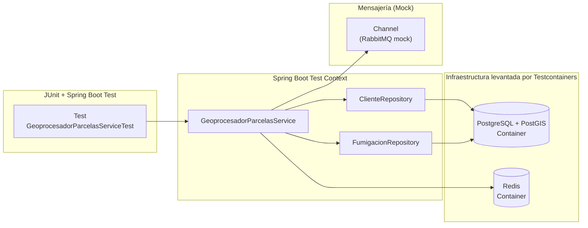

## Testeo de Integración

Al igual que en otros ejemplos, decidimos implementar tests de integración partiendo de nuestros services: eso permite que alcancemos más del 90% de cobertura.

## Test del servicio geoprocesador

Las dependencias que tenemos son

- por un lado necesitamos una instancia de la BD de clientes (Postgres)
- también necesitamos tener levantado el servicio de Redis, para guardar la información
- el servicio en sí es un listener de la queue, que estaremos mockeando para simular que nos llega data

La novedad que tiene este ejemplo es que **levanta contenedores Docker usando Testcontainers**:



### Setup

Anotamos el test con `@Testcontainer` y configuramos los contenedores de Docker para que trabajen en forma aislada del entorno de desarrollo:

```kotlin
@Testcontainers
@TestInstance(TestInstance.Lifecycle.PER_CLASS)
class GeoprocesadorParcelasServiceTest {

    companion object {
        private val postgisImage =
            DockerImageName.parse("postgis/postgis:15-3.4")
                .asCompatibleSubstituteFor("postgres")

        @Container
        @JvmStatic
        val postgres = PostgreSQLContainer<Nothing>(postgisImage).apply {
            withDatabaseName("facturacion_db")
            ...
        }

        @Container
        @JvmStatic
        val redis = GenericContainer<Nothing>(DockerImageName.parse("redis:7-alpine")).apply {
            ...

        @JvmStatic
        @DynamicPropertySource
        fun registerProperties(registry: DynamicPropertyRegistry) {
            registry.add("spring.datasource.url") { postgres.jdbcUrl }
            registry.add("spring.datasource.username") { postgres.username }
            ...
        }

        init {
            postgres.start()
            redis.start()
        }
    }
```

### Test por el caso feliz

El lector puede ver la implementación del caso feliz, que implica

- Arrange
  - tener limpia la base antes que nada (@BeforeEach)
  - tener un cliente registrado
  - tener un vuelo registrado
  - tener una posición que cae dentro de la parcela
- Act
  - simulamos que el service recibe la posición que acabamos de crear
- Assert
  - la queue tiene que haber recibido un ack
  - la base tiene que tener un registro de la fumigación con el cliente asociado

### Test por error (con reintentos)

Otro test interesante es cuando simulamos un error en el repositorio de Fumigación:

- Arrange
    - tener limpia la base antes que nada (@BeforeEach)
    - tener un cliente registrado
    - tener una posición que cae dentro de la parcela
    - controlamos que el repositorio de fumigación lance una excepción cuando intentemos guardar
- Act
    - simulamos que el service recibe la posición. Al procesar dicha posición se intenta guardar los datos de la fumigación pero **se produce un error**
- Assert
    - la queue tiene que haber recibido un nack
    - opcionalmente podríamos haber chequeado que no se genera ninguna información en Redis

### Otros tests

Para más detalle recomendamos ver la implementación de los tests, tanto del [geoprocesador](../src/test/kotlin/ar/edu/unsam/fumigacion/service/GeoprocesadorParcelasServiceTest.kt) como del [mensajero](../src/test/kotlin/ar/edu/unsam/fumigacion/service/GeoprocesadorParcelasServiceTest.kt) como del [facturador](../src/test/kotlin/ar/edu/unsam/fumigacion/service/FacturadorServiceTest.kt).